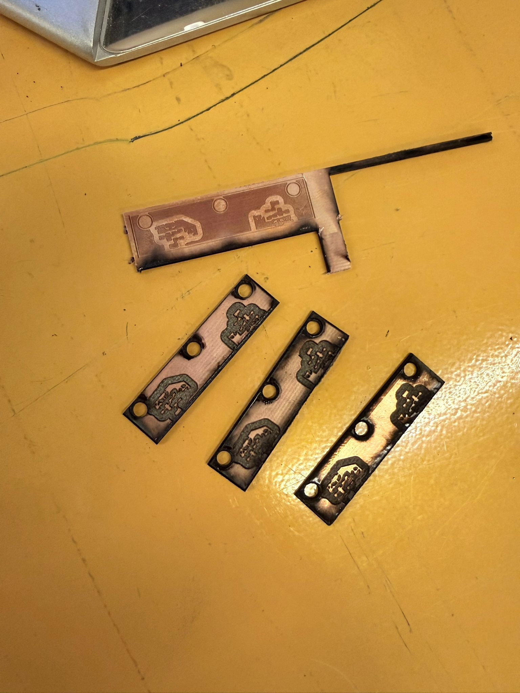

# Complete Guide for Laser-Cut PCB Manufacturing at ROMER

This report was created for the ME462 course, and it is focused on PCB production at ROMER.

## Step-by-Step Workflow

1. **Design**
   Create your PCB schematic and layout using any preferred PCB design software (e.g., Eagle, KiCad, or similar).
2. **Export Negatives**
   Export your completed design as negative images. This means areas where you want copper removed should be black, and regions where you want it kept should be white. Separate your export files based on the manufacturing operations: one file for engraving (removal of copper areas) and another file for cutting (defining board outlines and via holes).
3. **Use SVG and DXF Format**
   When exporting from your design software, select **SVG** (Scalable Vector Graphics) as the file export format. This ensures your design scales without loss of quality. Also, use a **DXF** (Drawing Exchange Format) file to create the boundaries for the PCB to cut.
4. **Open in Inkscape**
   Launch Inkscape and open your exported engraving SVG file.
5. **Apply Inkscape Settings**
   Perform these actions precisely in Inkscape:

   * Go to **File > Document Properties** and click on "Resize to content". Close this menu.
   * Click anywhere on your design and press `Ctrl+A` to select all elements.
   * From the **Path** menu, select **Stroke to Path** to convert any outlines into shapes. This is a critical step for laser engraving.
   * Immediately after, from the same **Path** menu, select **Union** to combine all converted shapes.
6. **Re-export SVG**
   Export the modified file again as an SVG to save these updated vector paths.
7. **Use xTool Software**
   Switch over to the native control software for your xTool F2 Ultra machine.
8. **Create Machine Layers**
   Within the laser software, create distinct layers. Place the geometry for engraving on one layer and the cutting geometry on another. This allows you to assign different laser parameters to each process.
9. **Import Engraving Data**
   Import the geometry you defined in Inkscape for areas to be engraved onto its corresponding layer.
10. **Engraving Parameters**
    For the engraving layer, set the operation type to "Engrave" and use these initial parameters:

    * **Laser Type:** MOPA IR (Infrared)
    * **Pulse Width:** 60
    * **Passes:** 25
    * **Power:** 80%
11. **Monitor Engraving**
    Closely observe the entire engraving process. You will notice that the laser beam typically glows green as it removes copper. **The moment the light shifts from green to a standard orange-red colour, stop the operation immediately.** This change in colour indicates that the laser has removed all copper and is beginning to etch the underlying laminate (FR4), which could quickly burn through.
12. **Cutting Setup**
    Move on to setting up the cutting operations. For clear board edges and via/through-hole outlines, it can be very practical to export your cutting layout as a DXF file and import it directly at this stage.
13. **Cutting Parameters**
    Assign the external board outline and any internal cutout geometry to your cutting layer. Select the "Cut" operation and use these parameters:

    * **Laser Type:** MOPA IR
    * **Pulse Width:** 60
    * **Passes:** 8
    * **Power:** 60%

    Execute the cutting operation.

---

## Important Process Notes & Best Practices

* **Substrate Durability:** Even though FR4 laminate offers significantly better resistance and durability than FR1 during laser processes, it is important to remember that it is still not indestructible. Excessive exposure from the laser can and will leave burnt edges and surface charring.
* **Tip for Cleaner Cuts:** To minimise burning, a more advanced workflow involves performing all your cutting passes *before* engraving. Use a custom-made jig (easily designed and 3D printed) that matches your board shape and external features. This jig can then be used to precisely flip the board over, allowing you to perform engraving and creation on the backside while minimising burn damage on the main front face.

---

## Guide for Creating DIY PCB Vias

A via is a plating or mechanical conductor that creates an electrical connection between different copper layers on a multi-layer printed circuit board (PCB). For single and double-sided PCBs, creating reliable DIY vias is crucial for signal integrity. Here are common methods for making vias at home, followed by a step-by-step process using the simplest technique:

### Common DIY Via Methods

* **Rivet Vias:** This is the most reliable and aesthetically pleasing DIY method. It involves inserting tiny brass or copper rivets (via pins) into drilled holes and then mechanically pressing or soldering them flush on both sides. This method offers excellent conductivity and high mechanical strength.
* **Wire Spike Vias:** This is the simplest and most accessible method. It requires inserting a small piece of thin wire (like a component lead or thin copper wire) through the drilled via hole and soldering it on both the top and bottom copper layers.

### Step-by-Step Guide for Creating Simple Wire Vias

1. **Drill via holes:** After your PCB is cut and etched, use a very fine drill bit (0.5 mm - 1.0 mm diameter, matching your via pad size) to drill completely through the pads on your board where a via connection is required.
2. **Insert wire:** Cut a short segment of thin copper wire (solid-core wire works best) and insert it completely through the drilled via hole.
3. **Solder the first side:** On the top copper layer, apply solder to the pad and wire lead. Solder the wire flush with the surface of the copper pad.
4. **Solder the second side:** Flip the PCB over and apply solder to the corresponding pad on the bottom copper layer, ensuring you make a solid connection with the same wire lead.
5. **Trim excess wire:** Use fine side cutters (like flush cutters) to snip any remaining wire spikes flush with the top and bottom copper pads.
6. **Verify electrical connection:** Use a digital multimeter in continuity or resistance mode to check the connection between the top and bottom pads of each via. A reading near zero ohms confirms a solid, low-resistance electrical pathway.
