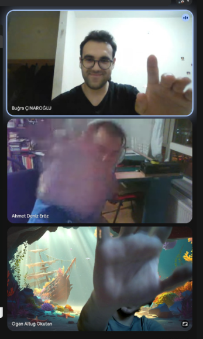
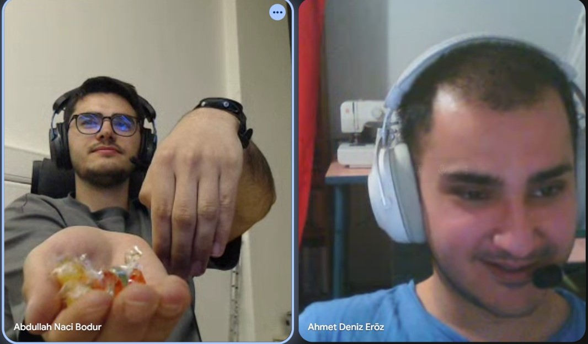
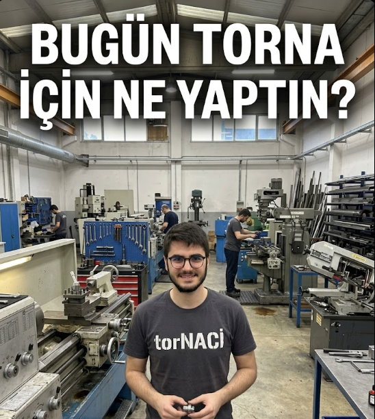
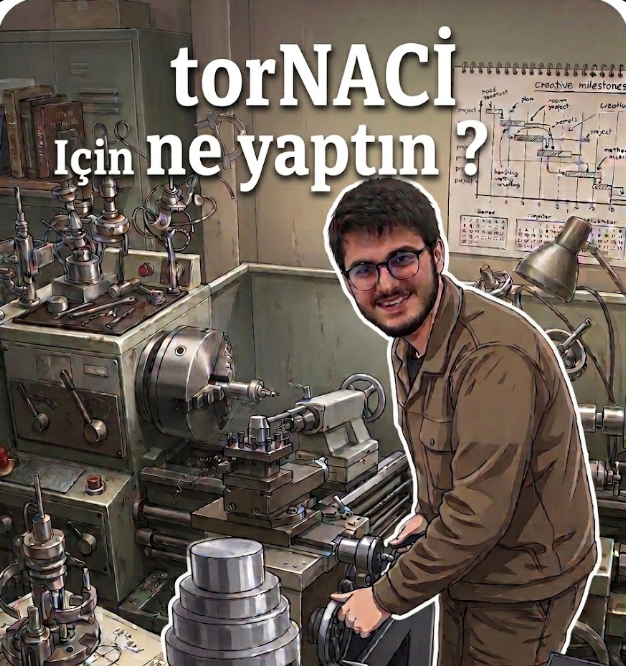

What we have done this week:

- Robot arm control will be continued, it requires more effort than we have expected. (/10)
- With the final version of the locking mechanism, the first version of the tool box needs to be tested.
  Accordigly, mechanical system of the toolbox designs must be updated. Since the charging will be important part of the toolbox,
  more search for it must be performed and discussed. (/10)
- Active tools will be discussed and searched. (Depending on them PCB specifications will be assigned.) (/10)
  - Some Already existing ideas:
      - Dragon head fire 
      - Lightsaber
      - Nerf (Something to fire)
      - Nail gun
      - Mesela araba tarzında  birşey tutsun, tool onu tutsun bıraksın gezsin biraz sonra tool geri onu tutsun.
      - Table tennis tarzı birşey veya 461 projesi gibi 
        (Rack and pinion düşün, gearın bir tarafı boş bir tarafı dolu. Dişler olduğu kısım çekince yayı sıkar. Boşa gelince yay bir anda patlarır.)(Vurma mekanizması)
      - Paper cutting mechanisms vs "https://www.youtube.com/watch?v=X-Pepnucxj4" 
        Mesela, bi plane belirtelim, tool sıfırlasın. Kağıdı koyalım, 3cm kes diyelim. orayı mesafe ölçsün ve kessin. 
        Ya da denizin lazerle 10 cm göstersin projesi mesela.
      - "https://www.youtube.com/shorts/ouqi2ZIhbjg"
      - "https://www.youtube.com/shorts/zmz0O5iZs5I"
      - Belki bir plate tutmak için pressure ile çeken bir tool.
      - Sulama sistemi, midibotun üzerine çiçek koyulur o gelir bizimki sular.
      - Grippers
        - adaptive fingers
        - magnetic tools
        - vacuum tools
        - insertion tools
        - Şöyle bir gripper denenebilir "https://www.youtube.com/shorts/aH7n_udyZGg"
      - Ahşap zımparalama toolu vs.
      - Tool üzerine bir ekran koyarız, ekrandan romer içinde nereye gitmek istediğini sorar, seçer. Sonra arm ile tool parmak gösterir gibi nereye gideceğini gösterir.
      - passive  tool olarak yine kalem koyarız UR5 in zaten belli açı dönme özelliği var angle vs çizilebilir.
   

17.04.2026 Meeting Minute:
- Bugra's design idea is discussed, arms with spring (buckling importance) is discussed.
- Ogan's idea tool box with design pin is discusssed.
- Mainly talked about the springback affect of the button is examined.
- Deniz's idea with the magnets and the pin is discussed. ü
- A new design for the tool changer with the magnets is presented by Deniz.

18.04.2026 Meeting Minute:
- Buğra's tool box design is drawn and discussed.
  - Naci decided to change the alignment of the arms so that it will be better.
- Deniz will draw the Ogan's idea with the pin.
- Buğra considered about the locking mechanism with more simple than wedge. Might be tried. Not fully desinged.
    

  

Naci photo Update "What have you done for TORNA today?"

