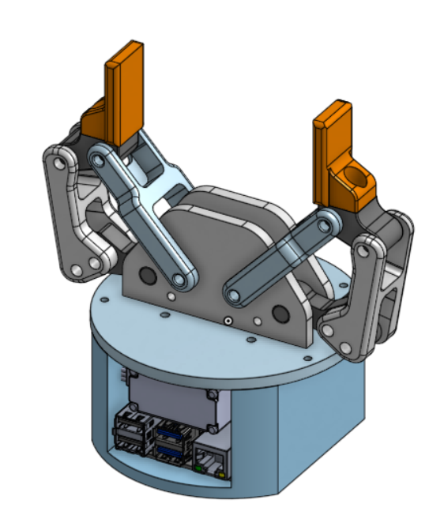
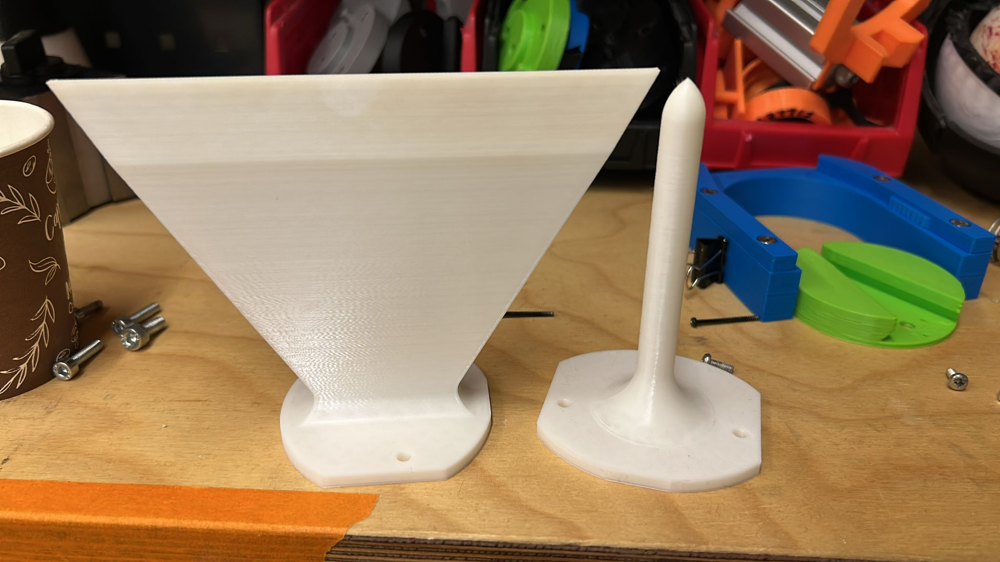
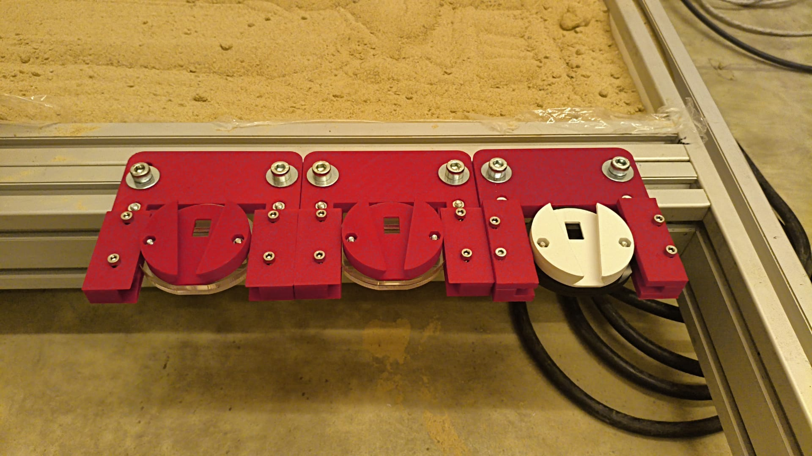
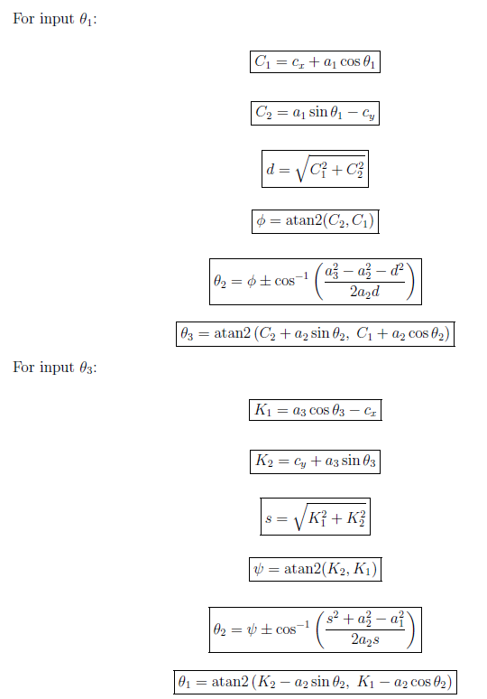
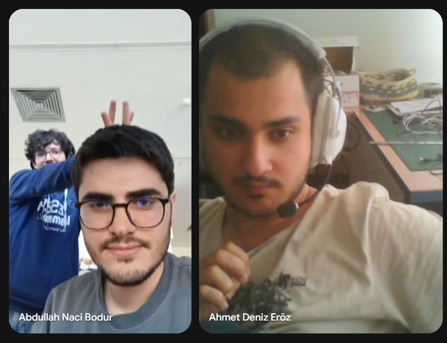
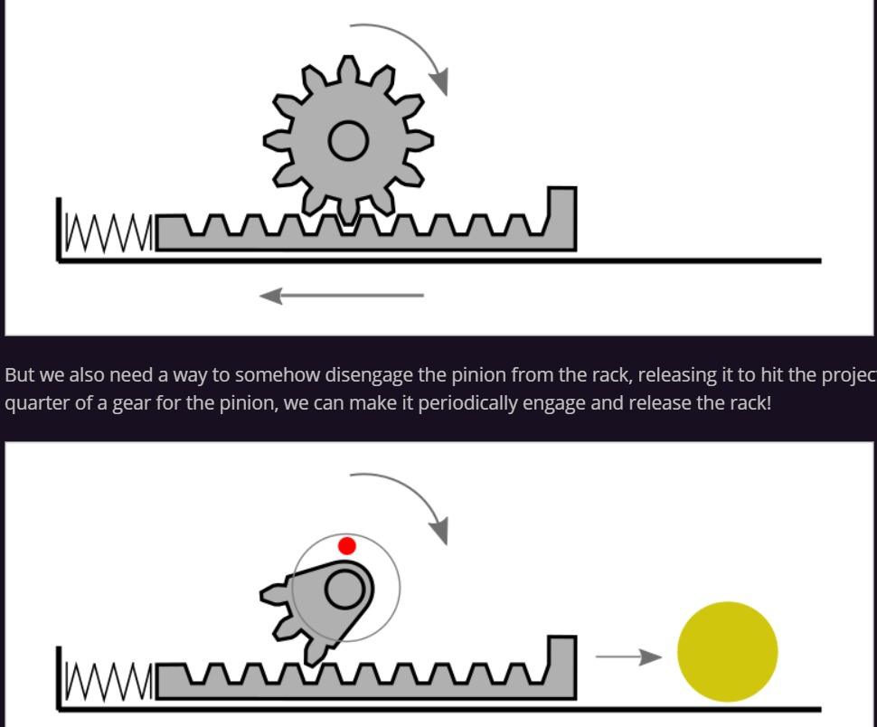
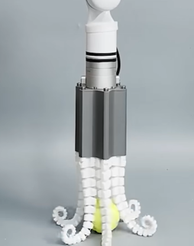
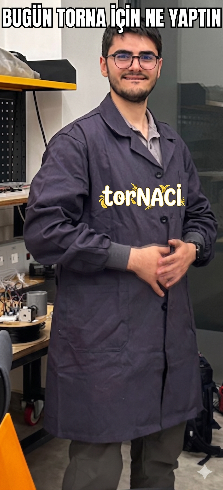
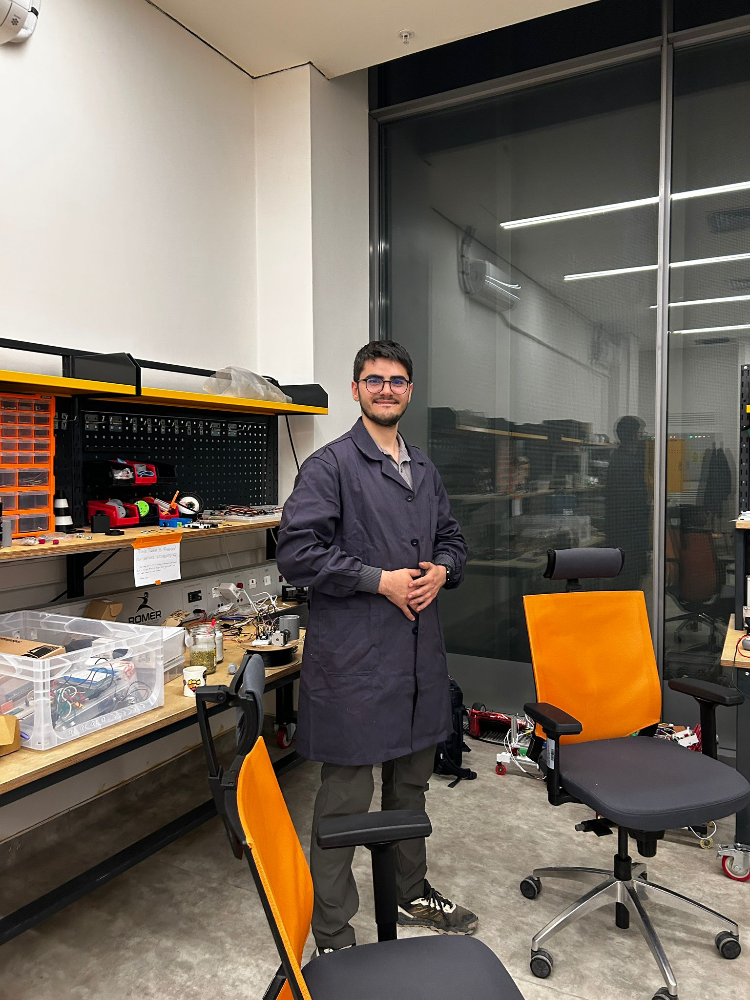
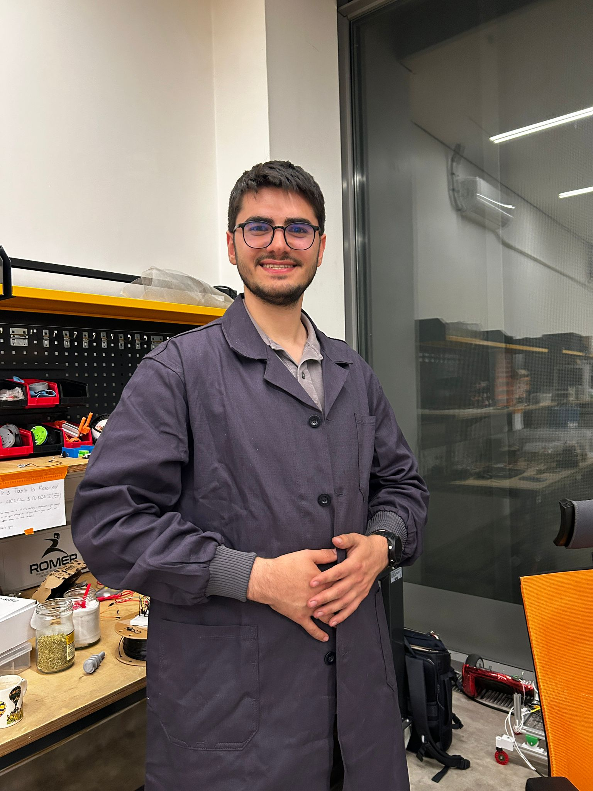

### What have we done this week:

- **Active tools are discussed. (/10)**
  - 1 Active tool is decided. A Face/Eye (Whether mechanic or in a LCD screen which follows the humans)
    https://www.youtube.com/shorts/ZUmvmScEfdM
  - Second active tool will be decided.

- **Naci designed and printed a design for the Gripper Mechanism. (Also, includes Raspberry Pi 4) (/10)**
   
  

- **Ogan printed some versions of the Zen Tool with the interface of handler/locking mechanism tool side. (/10)**
   
  

- **Deniz handled the tool box problems and printed. (/10)**

- **Fixed tool box is tested (/10)**
   
  <video src="tool_box_video1.mp4" width="320" controls></video>
   
  

- **Ogan tested different configuration of the tool box. (/10)**
   
  <video src="tool_box_video2.mp4" width="320" controls></video>

- **Buğra derived the kinematic relations for the Gripper Mechanism. (/10)**
  - Derivations and the source code is added as well.
     
    

---

### Point of this week (/10) = 

### 27.04.2026 Meeting Minute:

- **First Active tool concept is decided.** A Face/Eye (Whether mechanic or in a LCD screen which follows the humans)
- **Options for the second active tool is discussed.**
  - Some options:
    - A shooting mechanism for a nerflike mechanism
       
      
       
      https://www.youtube.com/watch?v=57T8I9CkCno
    - Tools like scissor/Screw Driver/Drill/Glue (Prit/Hot Glue)
    - Different kind of gripper mechanism.
       
      
       
      https://www.youtube.com/shorts/aH7n_udyZGg
    - Naci proposed a weird gripping mechanism that will work with two cameras and the deflection of points.
       
      https://punyo.tech/bubble-gripper.html
       
      https://www.youtube.com/watch?v=2fIzF_gmWG0

- **The process of the project will be fasten this 2 weeks due to şenlik and exams.**
- **Key Decisions:**
  - Naci will finalize the gripper.
  - Naci will make progress about the electrical interface and Pico.
  - Deniz & Buğra will deal with the image processing.
  - Ogan will try to move the arm with own robot control codes.
  - A final position of the tool box will be decided and will not be changed.
    - It will be positioned in the simulations and boundaries will be set.   

---

### What have we done for TORNA this week?

  
  
  

---

### What we are aiming to do this week:
- Naci will finalize the gripper.
- Naci will make progress about the electrical interface and Pico.
- Deniz & Buğra will deal with the image processing. (Raspberry Pi 4 will be used.)
- Ogan will try to move the arm with own robot control codes.
- A final position of the tool box will be decided and fixed.
- Hopefully, with the use of image processing, the robot arm will be controlled.
