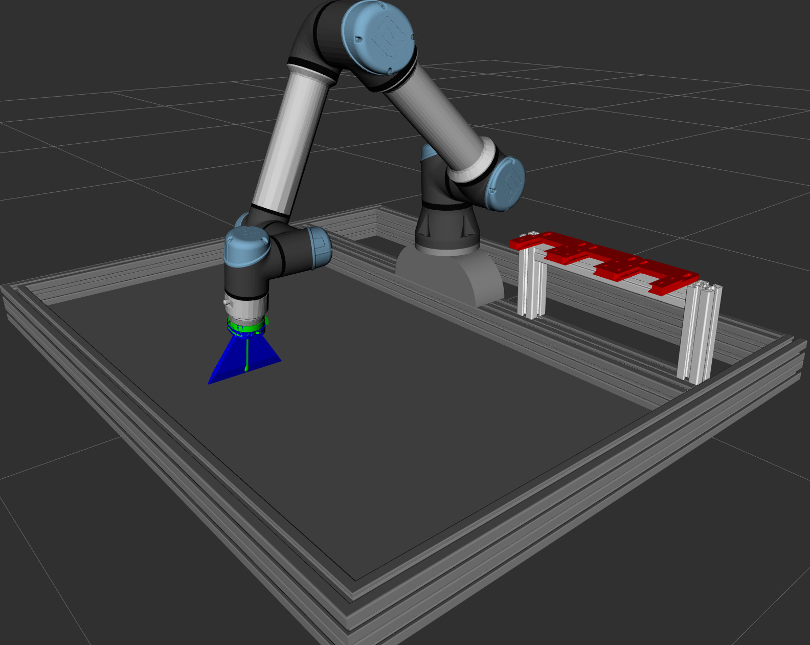
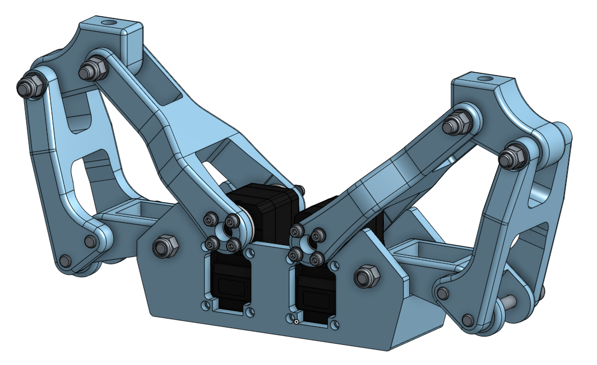
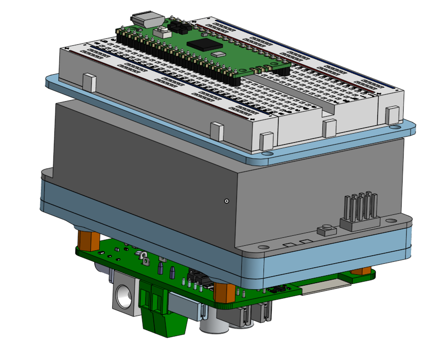

# Weekly Report: LittleDaisiesMKII - Week 12

* **Date Range:** April 28 - May 4, 2026

---

## 📊 Team Performance & Scoring

*Evaluation of specific tasks and deliverables based on project requirements.*

| Deliverable / Metric                        | Score          | Notes                  |
| :------------------------------------------ | :------------- | :--------------------- |
| Gripper Mechanism                           | X/10           |                        |
| Electrical Interface and Pico-Based Control | X/10           |                        |
| Image Processing on Raspberry Pi 4          | X/10           |                        |
| Robot Control via code                      | X/10           |                        |
| ToolBox position                            | X/10           |                        |
| **Total Score**                       | **X/60** | **Avg: X.XX/10** |

---

## 🤝 Meeting Notes

### [Day, Date] - Primary Meeting

**Key Discussion Points:**

* **Decisions:** [e.g., Naming convention finalized, communication protocols selected]
* **Hardware Progress:** [e.g., Zen Tool versioning, sieve manufacturing]
* **Simulation & Control:** [e.g., MuJoCo pose-to-pose testing, Robotictoolbox integration]
* **Manufacturing:** [e.g., PCB laser settings, KiCAD updates, via manufacturing]

---

### April 28 - May 02, 2026 - Follow-up / Technical Sync

* **April 28:** Completed the parametric design of the active tool **Tutan-Khamun**. All mechanical CAD files and servo control source codes have been organized within the project repository.
* **April 29 - April 30:** Developed servo control logic. Testing was conducted to drive servos via Pi Pico; however, due to efficiency concerns and timeline constraints, the system was transitioned to Raspberry Pi 4 control.
* **April 30:** Successfully moved the robot arm using custom control code. Additionally, a permanent position for the toolbox was established and maintained on the platform.

  
* **May 1:** Ogan suggested that we should chose [this](https://youtu.be/pQ2dI_B_Ycg?si=ietTri2PLfs5GCBM "bıcak_ceken_kol") as an active tool.
* **May 02:** Conducted hardware diagnostics and image processing development. Image processing was implemented using **MediaPipe**, while Raspberry Pi 4 booting was attempted for system integration.

  
* **Electronic Specs:** Finalized the compact electronics case design. The system integrates a **Waveshare 3S UPS Module** to provide regulated power (3V, 5V, 12V for servos), a shared ground, a kill switch, and a dedicated charging jack.

#### Media Documentation

* **Toolbox Positioning & Arm Movement:**
  [Video 1](./media/robot_control_code.mp4)
* **Tutan-Khamun Mechanics:**
  
  
* **Tutan-Khamun Electronics Case:**

  

## 🖼️ Visual Documentation & Progress

* Pending

---

## 🔗 Documentation Links

[Tutan-Khamun Project files](../../products/tool/active/tutan-khamun/)

## 📝 To-Do List (Action Items)

### Immediate Priority

- [ ] **Hardware:**
- [ ] **Software:**
- [ ] **Manufacturing:**

### Research & Documentation

- [ ] **Research:**
- [ ] **Reports:**
- [ ] **Maintenance:** Update README with latest links and media.
