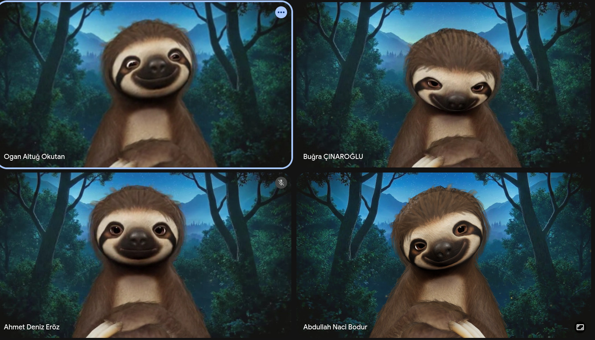
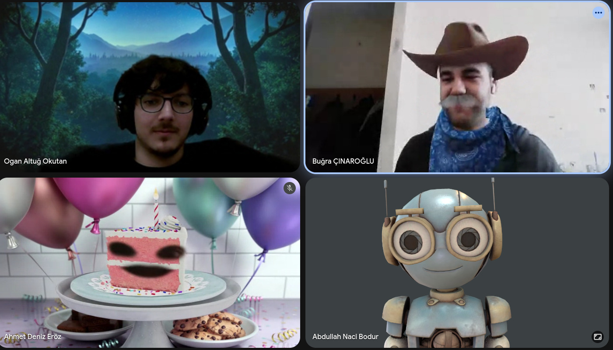
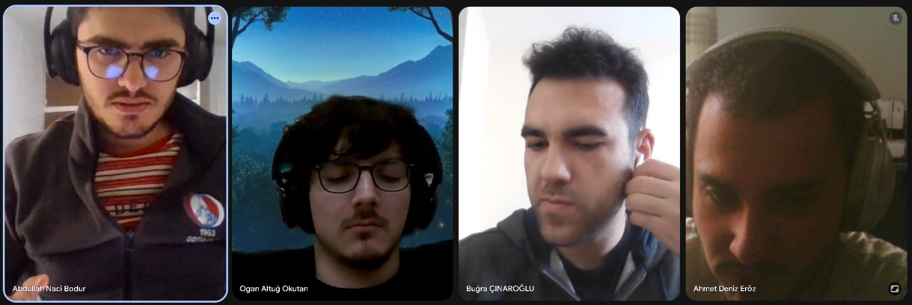

# Weekly Report: LittleDaisiesMKII - Week 12

* **Date Range:** April 28 - May 4, 2026

---

## 📊 Team Performance & Scoring

*Evaluation of specific tasks and deliverables based on project requirements.*

| Deliverable / Metric                        | Score          | Notes                  |
| :------------------------------------------ | :------------- | :--------------------- |
| Gripper Mechanism                           | X/10           |                        |
| Electrical Interface and Pico-Based Control | X/10           |                        |
| Image Processing on Raspberry Pi 4          | X/10           |                        |
| Robot Control via code                      | X/10           |                        |
| ToolBox position                            | X/10           |                        |
| **Total Score**                       | **X/60** | **Avg: X.XX/10** |

---

## 🤝 Meeting Notes

### [May 3, 2026] - Group Meeting

### **Key Discussion Points:**

* For technical sync, everyone mentioned what they have  done until the meeting. We did discuss what we will do untill the tuesday meeting and gather some thoughts about the ideas.
  <<<<<<< HEAD
* Deniz did some work on camera calibration via charuco markers and mentioned about it. He says that on the xy plane, there were errors but in the dept measurements, it was quite okay.
* Buğra mentioned that whether we need precise camera coordinate or what since we only tell if there is human and track him or play tick tack toe in the known space with robotic arm.
* Deniz mentioned that it would be a trouble when the camera does not see aruco markers. Follow ups were suggested:

  - We can use the fixed object to calculate the camera point in the space.
  - We can implement multiple aruco markers to the fixed points in the lab.
  - We can use 360 camera for the image processing.
* Ogan's written code worked on simulation but it does not go to the wanted locations.
* He will get time with the parameters and will read the documentation for therobot to write it from the scratch.
* Buğra mentions his trouble with the rasp pi 4. One of the machine has not a power hub and one of them did not even start booting.
* Naci mentioned what he did on this week. He mentioned about the problems he encountered during the control of the servos.
* Naci explains the electronic structure of the gripper **Tutan-Khamun** . We will use rasp pi 4 for the servo control and feedbacks. Maybe in the future, we can use esp32 or even pi pico to control the ST3215 servos. Our servo driver is not an efficient way of drive the servos.

=======

* Deniz did some work on camera calibration via charuco markers and mentioned about it. He says that on the xy plane, there were errors but in the dept measurements, it was quite okay.
* Buğra mentioned that whether we need precise camera coordinate or what since we only tell if there is human and track him or play tick tack toe in the known space with robotic arm.
* Deniz mentioned that it would be a trouble when the camera does not see aruco markers. Follow ups were suggested:

  - We can use the fixed object to calculate the camera point in the space.

  - We can implement multiple aruco markers to the fixed points in the lab.

  - We can use 360 camera for the image processing.
* Ogan's written code worked on simulation but it does not go to the wanted locations.
* He will get time with the parameters and will read the documentation for therobot to write it from the scratch.
* Buğra mentions his trouble with the rasp pi 4. One of the machine has not a power hub and one of them did not even start booting.
* Naci mentioned what he did on this week. He mentioned about the problems he encountered during the control of the servos.
* Naci explains the electronic structure of the gripper **Tutan-Khamun** . We will use rasp pi 4 for the servo control and feedbacks. Maybe in the future, we can use esp32 or even pi pico to control the ST3215 servos. Our servo driver is not an efficient way of drive the servos.

**Untill tuesday meeting:**

* Deniz will getting better results in calibration.Deniz will provide data for the errors he encountered in xy plane and depth.
* Deniz will move his setup [his pc with windows] to rasp pi ubuntu 22.04.
* Deniz maybe will try to use 360 camera.
* Buğra will try to boot rasp pi 4 and install ras 2 humble [We will all use ros 2 humble]
* Ogan will write the code for the robot control.
* Ogan will write **ROMER** to the sand using code, if he fails he will do it by hardcoding.
* Naci will write a demo for the st3215 servos by using Bus Servo Driver Hat A from the laptop with python.
* Naci will print 1.5/1 scale gripper Tutan-Khamun and assemblies it.
* Deniz will provide data for the errors he encountered in xy plane and depth.
* Deniz will move his setup [his pc with windows] to rasp pi ubuntu 22.04.
* Deniz maybe will try to use 360 camera.
* Buğra will try to boot rasp pi 4 and install ras 2 humble [We will all use ros 2 humble]
* Ogan will write the code for the robot control.
* Ogan will write **ROMER** to the sand using code, if he fails he will do it by hardcoding.
* Naci will write a demo for the st3215 servos by using Bus Servo Driver Hat A from the laptop with python.
* Naci will print 1.5/1 scale gripper **Tutan-Khamun** and assemblies it.
* Naci will assembly the electronics to show the setup. ( Since we are short in st3215 servos, we will not provide the actual setup. Both of them will be seperate.)

---

### April 28 - May 02, 2026 - Follow-up / Technical Sync

* **April 28:** Completed the parametric design of the active tool **Tutan-Khamun**. All mechanical CAD files and servo control source codes have been organized within the project repository.
* **April 29 - April 30:** Developed servo control logic. Testing was conducted to drive servos via Pi Pico; however, due to efficiency concerns and timeline constraints, the system was transitioned to Raspberry Pi 4 control.
* **April 30:** Successfully moved the robot arm using custom control code. Additionally, a permanent position for the toolbox was established and maintained on the platform.

  
* **May 1:** Ogan suggested that we should chose [this](https://youtu.be/pQ2dI_B_Ycg?si=ietTri2PLfs5GCBM "bıcak_ceken_kol") as an active tool.
* **May 1:** Deniz made camera calibration via **Charuco** markers. In every lighting changes, he needed to calibrate the cameras according to the calibration pattern.
* **May 02:** Conducted hardware diagnostics and image processing development. Image processing was implemented using **MediaPipe**, while Raspberry Pi 4 booting was attempted for system integration.

  
* **Electronic Specs:** Finalized the compact electronics case design. The system integrates a **Waveshare 3S UPS Module** to provide regulated power (3V, 5V, 12V for servos), a shared ground, a kill switch, and a dedicated charging jack.

#### Media Documentation

* **Toolbox Positioning & Arm Movement:**
  [Video 1](./media/robot_control_code.mp4)
* **Tutan-Khamun Mechanics:**

  
* **Tutan-Khamun Electronics Case:**

  

🖼️ Visual Documentation & Progress

* Pending

---

## 🔗 Documentation Links

[Tutan-Khamun Project files](../../products/tool/active/tutan-khamun/)

## 📝 To-Do List (Action Items)

### Immediate Priority

- [ ] **Hardware:**
- [ ] **Software:**
- [ ] **Manufacturing:**

### Research & Documentation

- [ ] **Research:**
- [ ] **Reports:**
- [ ] **Maintenance:** Update README with latest links and media.
