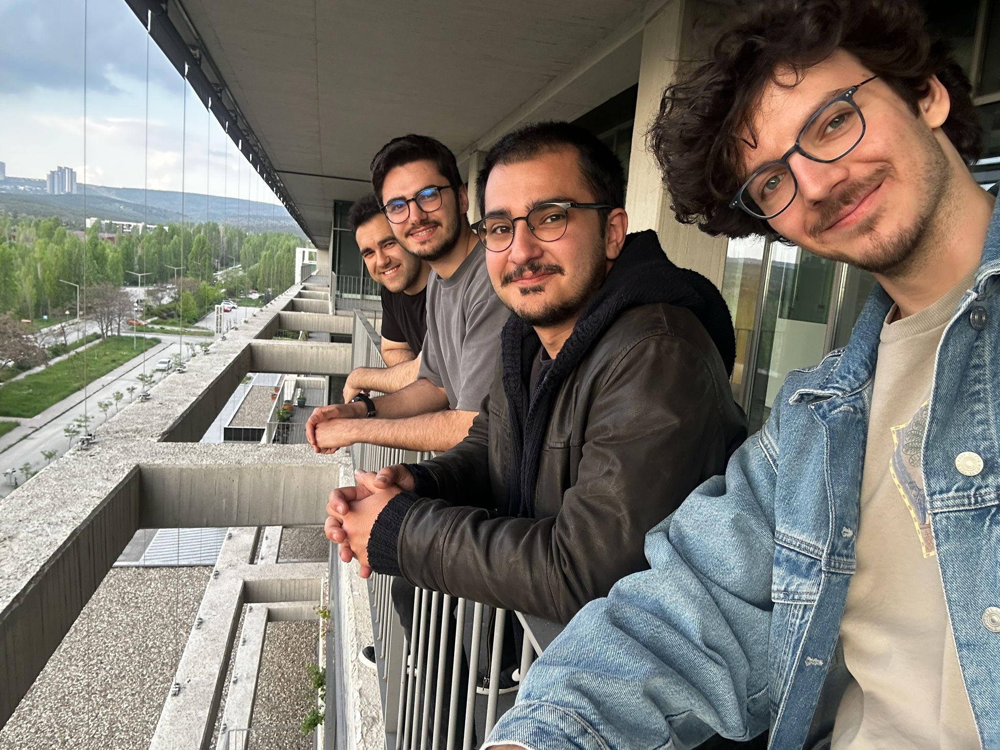
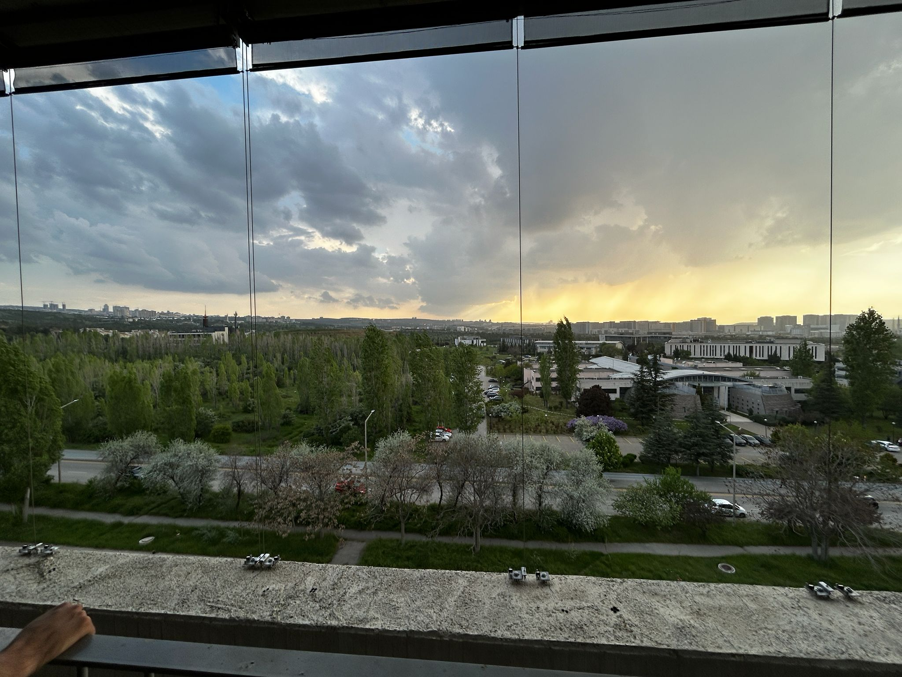
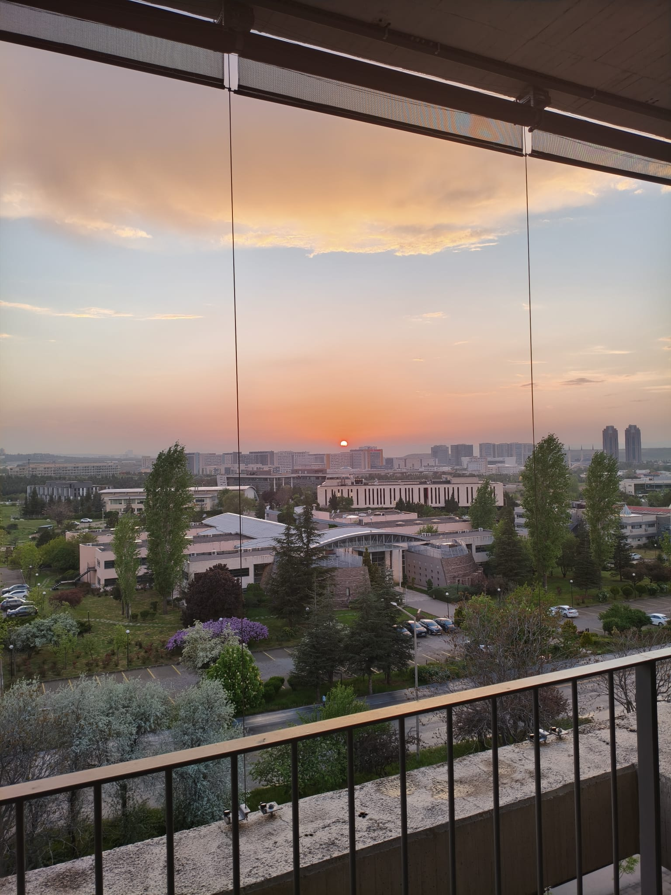
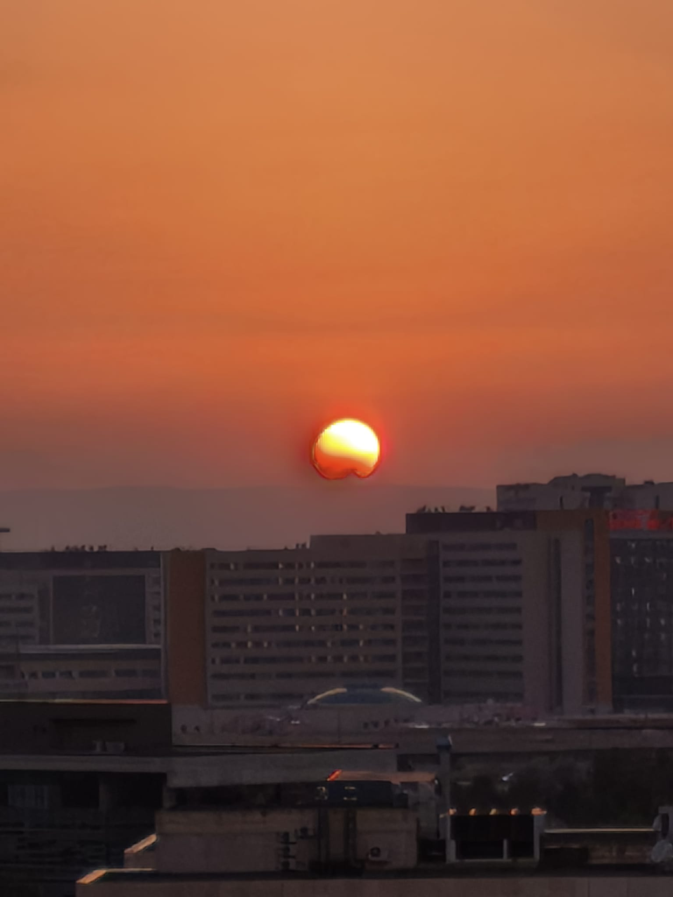
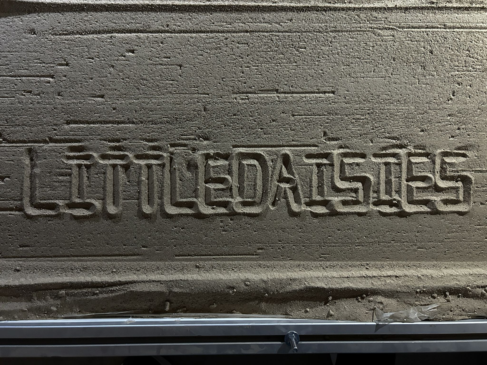
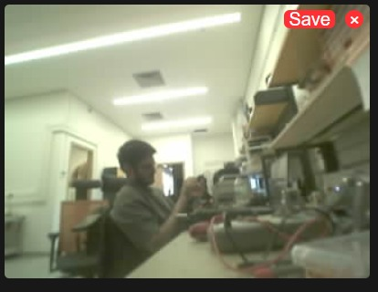
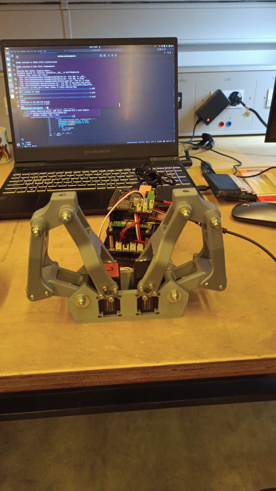

# Weekly Report: LittleDaisiesMKII - Week 13

**Date Range:** May 5 - May 12
---
## 📊 Team Performance & Scoring

*Evaluation of specific tasks and deliverables based on project requirements.*
| Deliverable / Metric            | Score          | Notes                            |
| :------------------------------------------ | :------------- | :--------------------- |
| Robot control and sand writing  | 10/10          | We are able to write onto the sand  |
| Checking the new hardware given | 8/10           | Mini esp and the camera is checked  |
| Gripper force control           | 7/10           | both force with current and fsr is tried|
| Image Processing                | 5/10           | an object is followed via servo no updat eon arucos |
| ?????????????????????           | ?/10           | ??????????????????????????????????????????????      |
| **Total Score**  | **X/60** | **Avg: X.XX/10**           |
---

## 🤝 Meeting Notes

### May 11 - Group Meeting

**Key Discussion Points:**
Everyone is explained what they have done for the past week. 
* Buğra worked on image processing on Rasppery Pi, and successfully followed and object (human) by tip of the servo. He also tried to work with FSR, and sucessfully implemented the FSR force control to the 2f-85 gripper machanism. Finally, he tried to work with the given esp32 with integrated camera but did not like the output feed quality.
* Ogan kept working on the robot control. He finalized the sand-writing process, and now we are able to write on the sand. He also created a docker file for other members to efficiently and easiliy get into the robot control. Thanks Ogan.
* Naci kept wroking on the gripper mechanism, electronics and software. He mainly focussed on the force control via current readings, however he faced with some problems. Currently the current-force control is not as reliable as we wanted. He also gathered the documentations and files about the gripper so that other members of the group can succesfully get into the gripper part.
* Deniz, wrote this meeting minute.

## 🖼️ Visual Documentation & Progress

## 🔗 Documentation Links
[Robot Control Docker Repo](https://github.com/OganAltug/ME462ZenPoolWorkspace)

## 📝 To-Do List (Action Items)

### Immediate Priority

- [ ] **Hardware:** Redesign [Component] based on recent test results.
- [ ] **Software:** Implement [Feature] in simulation environment.
- [ ] **Manufacturing:** Obtain [Material/Part] and fabricate [Item].

### Research & Documentation

- [ ] **Research:** Investigate [Mechanism/Protocol] alternatives.
- [ ] **Reports:** Document [Naming Convention/Interface Requirements].
- [ ] **Maintenance:** Update README with latest links and media.
