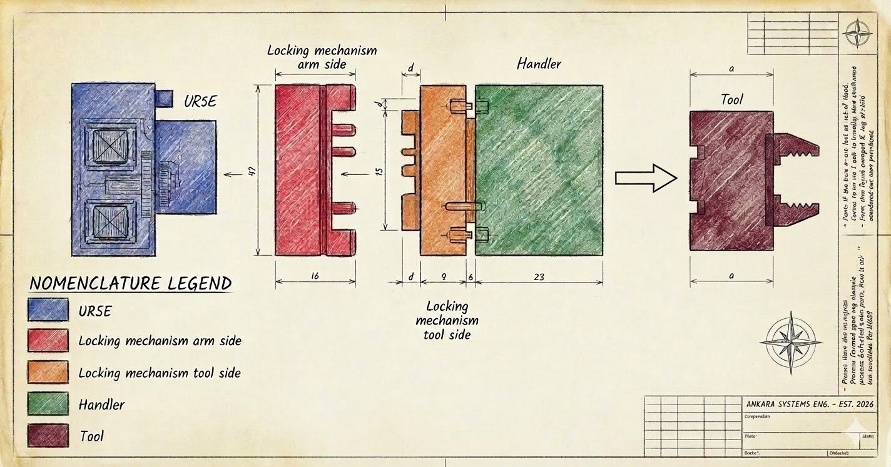
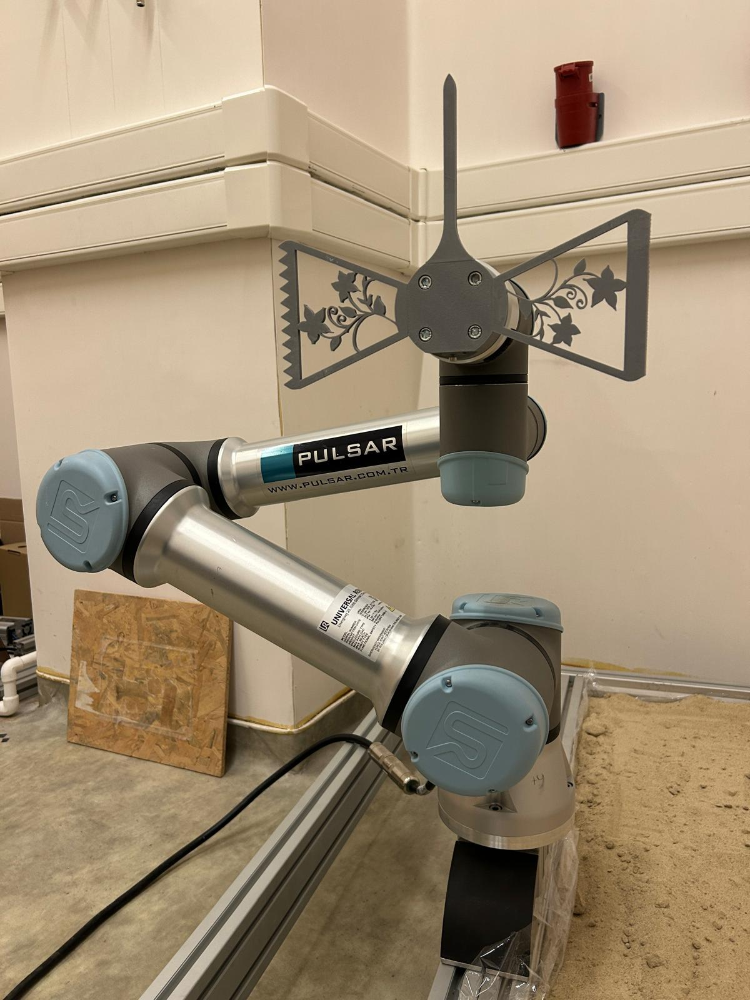
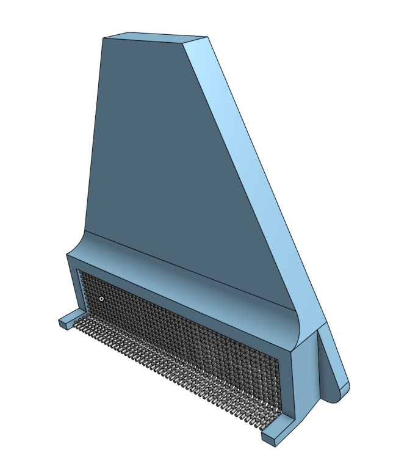
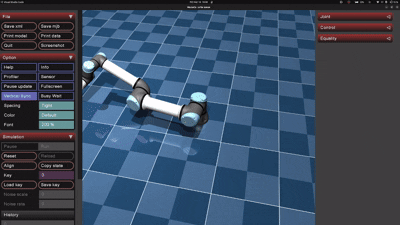

Team Points:

- Naming convention revision 6/10
- meeting minute 10/10
- Locking interface PCB requirements 5/10
- Locking interface Mechanical requirements 8/10
- Robot control 7/10
- Zen tool  (rotated by pi/2) 8/10
- Total 44/60 --> avg 7.33/10

Monday Meeting Notes:

* Naming convention has been decided as below:

- Designed and manufactured first version of Zen Tool

  
- Designed sieve for ZenTool
- 
- Tested very basic UR5e pose to pose motion with MuJoCo and Robotictoolbox library

  
- Defined some requiremnts of the tool interface/handler [Requirements](../../Requirements/Readme.md)
- Discussed PCB manufacturing. [Check the PCB Manufacturing Report](../../PCB/HowToLaserPCB.md)

  - Via manufacturing details, new ideas
  - Xtool setting to manufacture PCBs, KiCAD settings etc.
- Kinematic coupling ideas:
   [Google Doc for Locking Mechanism Ideas](https://docs.google.com/document/d/15yzl3hxYkYvtqdlGrBOaPBBX_cD7uZbD/edit?usp=sharing&ouid=110519594456022773011&rtpof=true&sd=true)
  - Dremel not a good idea
  - Active locking with UR5e power cable (Buğra found a paper about it)
  - The one with the multiple balls (like a bearing)
    --> doesnt lock rotation
  - Self-releasing grapple mechanism (again doesnt lock rotation)
  - locking kinematic links, with hinges to unlock

- Discussed locking interface essentials

To Do:

- Redesign/tweak Zen tool based on its tested structural and functional qualities
- Look into other alternative simulators (maybe)
- Implement Zen tool into Mujoco, draw some stuff (maybe laterrrr)
- Design and test some quick connect/release mechanisms (?)
- Look into PCB design and components that we could use (?)
- Look into UR5e serial connection details
- Manufacture sieve (obtain wire first)
- List all possible locking mechanisms in a file
- Write locking interface requirements
- Document naming convention
- Add links to this readme

Tuesday Meeting Notes:
- Microcontroller wifi, deep-sleep, wifi wake support
- 
