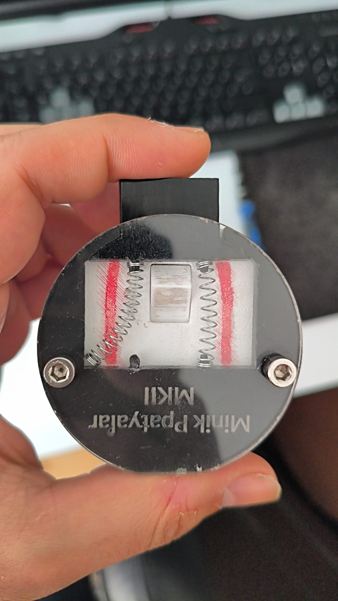
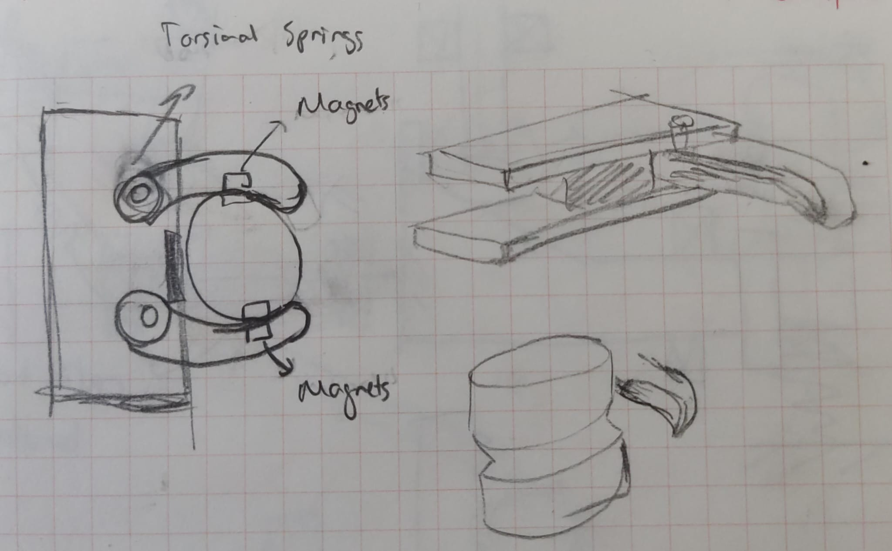
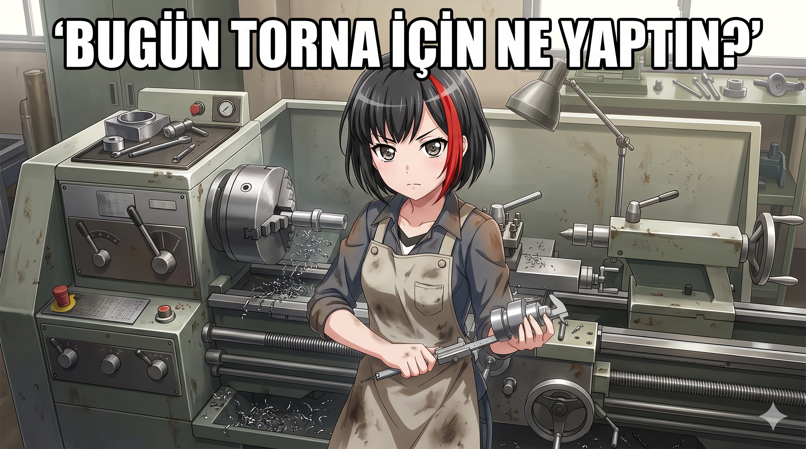
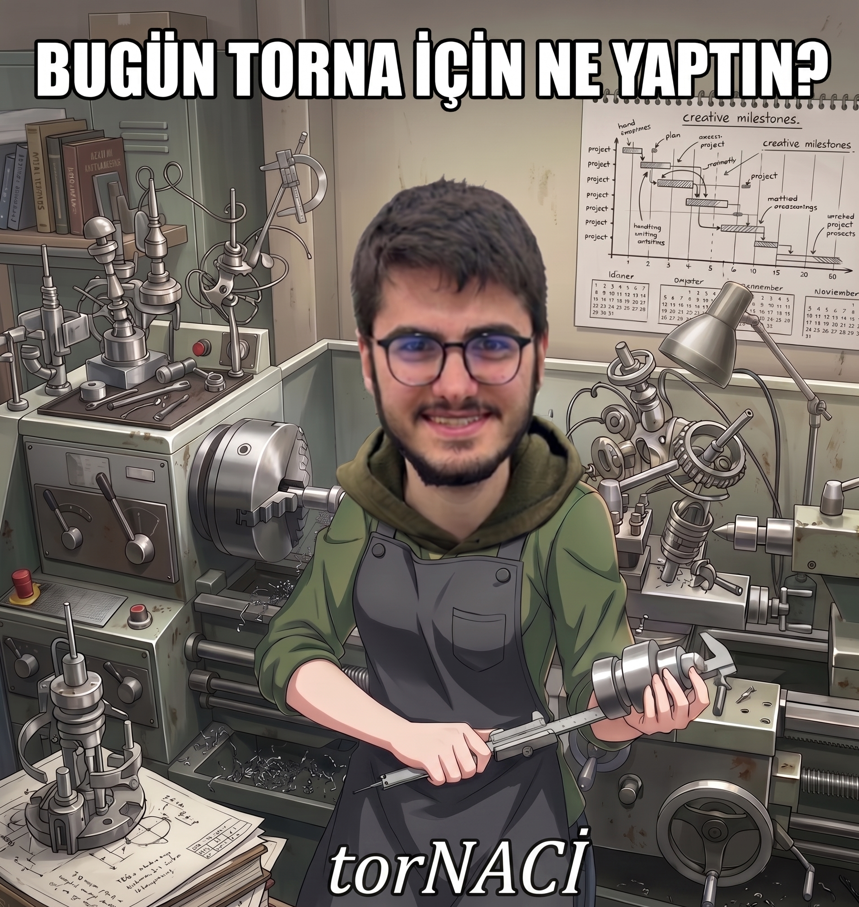
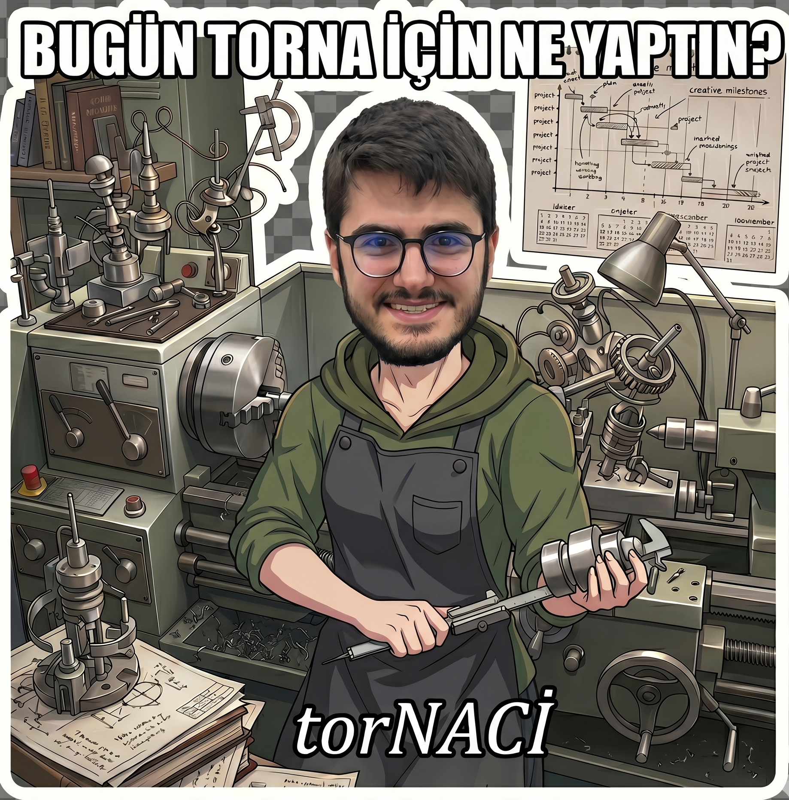

What we have done this week:

- Robot Arm Control will be still in progress. (/10)
  - Ogan continued to show some progress in the robot arm control. Some simulations are done.   
    - [Video 1](./armcontrol_ogan.mp4)  
    - Some problems encountered.
      - Both MuJoCo and ROS have little/no documentation regarding the robot arm control.
      - Most likely C++ use will be needed (Buğra does not have much experience in C++).

- Optimization of the Dovetail & Pin Locking Mechanism will be performed. (/10)
  - Deniz optimized the dovetail and the pin locking mechanism further. Almost finalized the concept.   
    - [Video 1](./locking_deniz1.mp4)  
    - [Video 2](./locking_deniz2.mp4)
  - Buğra has considered a different type of pin system which might be more usable for charging connections in the toolbox. (Probably Deniz's system will be used anyway.)  
    

- An initial design for the tool box will be done according to the Locking Mechanism (for simple testing purposes). (/10)
  - Naci designed a toolbox concept.  
    
  - Buğra designed a toolbox concept with rotational springs and moving arms (might contain magnets for better stability). Hasn't manufactured it yet.  
    
  - For toolbox charging, some investigations were made.
    - Pogo pin charger will most likely be used:  
      "https://www.komponentci.net/2-pin-10mm-90c-kablolu-pcbli-pogo-pin-manyetik-konnektor-takimi-type-c-soketli-pmu47925"  
      Arguably the best option. Magnets would give ease of control.
    - Wireless telephone chargers might be an option:  
      "https://www.trendyol.com/ebotek/sbz-apple-magsafe-sarj-aleti-seti-20w-adaptor-ile-iphone-11-12-13-14-15-16-17-tum-modellere-uyumlu-p-813046065"  
      Financial limitations might be problematic.  
      The system must be intact in order to charge; slight slips might cause problems.
    - Cable charger, C-type / barrel connector.  
      Unlikely to be used since plugging a cable might be problematic and would require a high level of robot arm control with a more optimized locking mechanism.

Overall Score /30 =

What to do in the next week:

- Robot arm control will be continued, it requires more effort than we have expected.
- With the final version of the locking mechanism, the first version of the tool box needs to be tested.
    Accordigly, mechanical system of the toolbox designs must be updated.
    Since the charging will be important part of the toolbox, more search for it must be performed and discussed.
- Active tools will be discussed and searched. (Depending on them PCB specifications will be assigned.)
  - Some Already existing ideas:
    - Eye who tracks the person that it sees.
    - Some sort of gripping mechanisms.
    - torNA. (Naci's favorite) (Bugün torna için ne yaptın???)  

